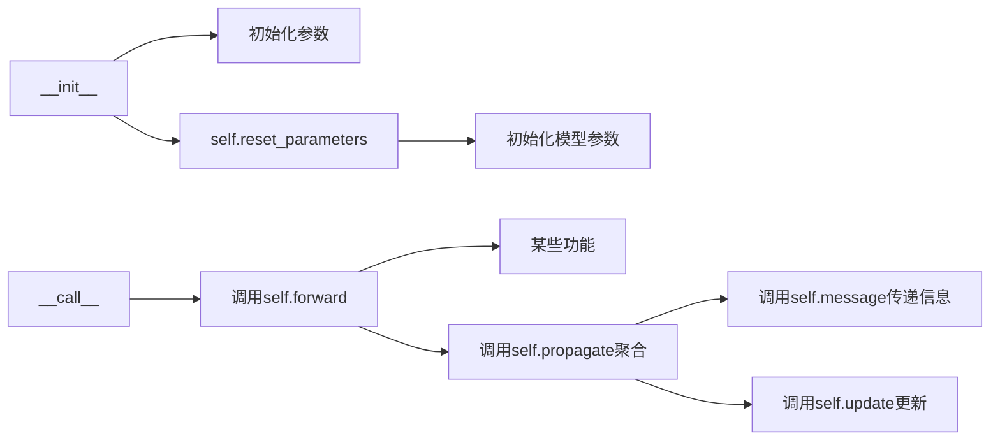

[TOC]

----
## 1. 概念
**GCN**（**Graph Convolutional Network**，图卷积网络）是**GNN**的一种，它通过图卷积操作来更新节点的特征表示。
不深究过于硬核的数学上的频域和时域的推导，我们从模型和代码来学习。

----

## 2. 公式
### 2.1 矩阵实现的更新公式
在一轮节点更新中，我们会输入两个数据：

>$H^{(l)}$: **(m, f)** 特征矩阵，m表示节点的数量，f表示节点的维度
$A$: **(m, m)** 邻接矩阵（无自环）  

我们用一个例子来说明一下两者相乘会发生什么（为了方便这里给$A$加上了自环）：
这里的$\boldsymbol{h}_i$是 **(f,)** 的向量，表示第i个节点的特征向量
$$
AH=
\left(\begin{array}{lll}
    1 & 1 & 0 \\ 
    1 & 1 & 0 \\ 
    0 & 0 & 1\end{array}\right)
\left(\begin{array}{c}
    \boldsymbol{h}_1 \\ \boldsymbol{h}_2 \\ \boldsymbol{h}_3\end{array}\right)=
\left(\begin{array}{c}
    \boldsymbol{h}_1 + \boldsymbol{h}_2 \\ 
    \boldsymbol{h}_1 + \boldsymbol{h}_2 \\ 
    \boldsymbol{h}_3\end{array}\right)
$$

通过这个操作后，就相当于将这个节点所有的邻接的节点（加上自己）给加到一起了。

从这里就可以看出图卷积其实可以看成一种特殊的全连接层。全连接层下一层的一个节点=上一层所有节点加权相加，而图卷积的下一层的一个节点只和其所有相邻的节点有关系。

那我们开始公式推导：
首先，$D$是$A$对应的度矩阵。
为两个矩阵添加上自环：
$$
\tilde{A}=A+I  \\
\tilde{D}=D+I
$$
那么节点的更新的公式就是：
$$
H^{(l+1)}= \sigma\left(\tilde{D}^{-\frac{1}{2}} \tilde{A} \tilde{D}^{-\frac{1}{2}} H^{(l)} W^{(l)}\right)
$$

$H^{(l+1)}$: **(m, f')** 更新后的特征矩阵
$H^{(l)}$: **(m, f)** 原始特征矩阵
$W^{(l)}$: **(f, f')** 节点更新权重矩阵，**这是模型要学习的参数**    
$\tilde{D}^{-\frac{1}{2}} \tilde{A} \tilde{D}^{-\frac{1}{2}}$: 这一步是为了标准化（后面解释）
$\sigma$: 激活函数

也可以这样写：
$$
\begin{gathered}\widehat{A}=\tilde{D}^{-\frac{1}{2}} \tilde{A} \tilde{D}^{-\frac{1}{2}} \\ 
H^{(l+1)}=\sigma\left(\widehat{A} H^{(l)} W^{(l)}\right)\end{gathered}
$$

考虑进截距就是这样：
$$
H^{(l+1)}=\sigma(\widehat{A} H^{(l)} W^{(l)}+b^{(l)})
$$
$b^{(l)}$: **(f',)** 截距向量，这里显然广播到了 **(m, f')**


### 2.2 非矩阵实现的更新公式
我们定义一个矩阵$C$ **(m, m)** :
$$\frac{1}{c_{i j}}=\frac{1}{\sqrt{\operatorname{deg}\left(v_i\right)} \cdot \sqrt{\operatorname{deg}\left(v_j\right)}}$$

$v_j$: 第j个节点（节点本身）
${\operatorname{deg}\left(v_j\right)}$: 第j个节点的度

根据定义不难得到下面的式子（也可以自己动手举例子推导）:
$$\frac{1}{c_{i j}}=\frac{1}{\sqrt{\operatorname{deg}\left(v_i\right)} \cdot \sqrt{\operatorname{deg}\left(v_j\right)}}=
(\tilde{D}^{-\frac{1}{2}} \tilde{A} \tilde{D}^{-\frac{1}{2}})_{i j}
$$

就可以得到下面这个更新公式：
$$
h_i^{(l+1)}=\sigma\left((\sum_{j \in N_i} \frac{1}{c_{i j}} h_j^{(l)}) W^{(l)}+b^{(l)}\right)
$$

$h_i^{(l+1)}$: **(f',)** 第i个节点的更新后的特征向量
$h_i^{(l)}$: **(f,)** 第i个节点的原始特征向量
$N_i$: 第i个节点的邻居节点的集合
$\sum_{j \in N_i} \frac{1}{c_{i j}} h_j^{(l)}$: **(f,)** 第i个节点的所有邻居节点的加权求和
$b^{(l)}$: **(f',)** 截距向量，这里就不要广播了

----

## 3. 流程图
该模型难度不大，故略之

----

## 4. 代码
由于pytorch和PyG的batch组织方式不同（具体参考：https://blog.csdn.net/wwl412095144/article/details/144066527?spm=1001.2014.3001.5502）

我们用torch实现矩阵公式版本，用PyG实现非矩阵公式版本。

### pytorch实现
```python
import torch
import torch.nn as nn

def normalized_adjacency(adj):
    """输入A, 返回A^，支持批量处理"""
    # adj: [B, m, m]
    batch_size, num_nodes, _ = adj.shape
    # 计算度矩阵 D
    d = torch.sum(adj, dim=2)  # [B, m]
    d = d + 1  # 对角线元素加1，相当于加上自连接
    d_inv_sqrt = torch.pow(d, -0.5)  # [B, m]
    d_inv_sqrt = torch.diag_embed(d_inv_sqrt).to(adj.device)  # [B, m, m]
    a = adj + torch.eye(num_nodes).unsqueeze(0).to(adj.device)  # 加上自连接
    a_norm = d_inv_sqrt @ a @ d_inv_sqrt
    return a_norm

class GCN(nn.Module):
    def __init__(self, in_features, out_features):
        super(GCN, self).__init__()
        self.weight = nn.Parameter(torch.FloatTensor(in_features, out_features))
        self.reset_parameters()

    def reset_parameters(self):
        stdv = 1. / (self.weight.size(1) ** 0.5)
        self.weight.data.uniform_(-stdv, stdv)

    def forward(self, x, adj):
        # x: [B, m, f]
        # adj: [B, m, m]
        adj = normalized_adjacency(adj)
        # 使用 bmm 进行批量矩阵乘法
        return torch.bmm(adj, torch.bmm(x, self.weight.unsqueeze(0).expand(x.size(0), *self.weight.shape)))

# 测试代码
x = torch.randn(6, 10, 5)  # [B, m, f]
adj = torch.randn(6, 10, 10)  # [B, m, m]
gcn = GCN(5, 10)  # 输入特征维度为5，输出特征维度为10
output = gcn(x, adj)
print(output.shape)  # [6, 10, 10]
```

<br>

### PyG实现
```python
import torch
import torch.nn.functional as F
from torch_geometric.nn import MessagePassing
from torch_geometric.data import Data, DataLoader
from torch_geometric.utils import add_self_loops, degree


class GCNConv(MessagePassing):
    def __init__(self, in_channels, out_channels):
        super(GCNConv, self).__init__(aggr="add")  # "add" aggregation.
        self.lin = torch.nn.Linear(in_channels, out_channels)

    def forward(self, x, edge_index):
        """
        x: (M, f)
        edge_index: (2, e_0)
        """

        # 添加自连接 edge_index: (2, e_0) -> (2, e)
        edge_index, _ = add_self_loops(edge_index, num_nodes=x.size(0))

        # 通过线性层 x: (M, f) -> (M, f')
        x = self.lin(x)

        # 标准化
        row, col = edge_index  # row: (e,) 每条边的起始节点, col: (e,) 每条边的终止节点
        deg = degree(col, x.size(0), dtype=x.dtype)  # (M,) 度矩阵，对应每个节点的度
        deg_inv_sqrt = deg.pow(-0.5)
        deg_inv_sqrt[deg_inv_sqrt == float("inf")] = (
            0  # 原来的0，-0.5次幂变成inf，现在把其变回来
        )
        norm = deg_inv_sqrt[row] * deg_inv_sqrt[col]  # (e,) 对应每条边的权重

        # 聚合
        return self.propagate(edge_index, x=x, norm=norm)

    def message(self, x_j, norm):
        """
        edge_index[0]: (e,) 每条边的起始节点
        x_j = x[edge_index[0]]: (e, f')  每条边的起始节点的特征形成的矩阵

        这个函数实现传播的功能。我们的公式都是站在节点的角度考虑的，而PyG内部考虑的是边。
        我们不要遍历每个节点，我们遍历每一条边，然后将特征从起始边传播到终点边就可以了。
        然后记得给每一条边乘以权重（按行相乘，因为每个节点的特征是一个行向量），然后返回。
        """
        return norm.view(-1, 1) * x_j  # (e, 1) * (e, f') 发生广播

    def update(self, aggr_out):
        return aggr_out


x1 = torch.tensor([[1, 2], [3, 4], [5, 6]], dtype=torch.float)
edge_index1 = torch.tensor([[0, 1, 1, 2], [1, 0, 2, 1]], dtype=torch.long)
y1 = torch.tensor([0, 1, 0], dtype=torch.long)

x2 = torch.tensor([[7, 8], [9, 10], [11, 12]], dtype=torch.float)
edge_index2 = torch.tensor([[0, 1, 1, 2], [1, 0, 2, 1]], dtype=torch.long)
y2 = torch.tensor([1, 0, 1], dtype=torch.long)

data1 = Data(x=x1, edge_index=edge_index1, y=y1)
data2 = Data(x=x2, edge_index=edge_index2, y=y2)

loader = DataLoader([data1, data2], batch_size=2)

model = GCNConv(2, 3)
for batch in loader:
    out = model(batch.x, batch.edge_index)
    print(out)

##output:
tensor([[-0.3350, -1.4275,  1.3389],
        [-0.2474, -2.3528,  2.3656],
        [-0.0558, -2.2894,  2.3984],
        [ 0.4258, -3.7761,  4.2258],
        [ 0.7159, -5.3261,  6.0204],
        [ 0.7051, -4.6381,  5.2853]], grad_fn=<ScatterAddBackward0>)
```
<br>

总结：继承重写MessagePassing类的方法（一般propagate都不用重写）：


<br>
当然，我们可以直接导入GCN层

```python
import torch
from torch_geometric.nn import GCNConv
from torch_geometric.data import Data, DataLoader

x1 = torch.tensor([[1, 2], [3, 4], [5, 6]], dtype=torch.float)
edge_index1 = torch.tensor([[0, 1, 1, 2], [1, 0, 2, 1]], dtype=torch.long)
y1 = torch.tensor([0, 1, 0], dtype=torch.long)

x2 = torch.tensor([[7, 8], [9, 10], [11, 12]], dtype=torch.float)
edge_index2 = torch.tensor([[0, 1, 1, 2], [1, 0, 2, 1]], dtype=torch.long)
y2 = torch.tensor([1, 0, 1], dtype=torch.long)

data1 = Data(x=x1, edge_index=edge_index1, y=y1)
data2 = Data(x=x2, edge_index=edge_index2, y=y2)

loader = DataLoader([data1, data2], batch_size=2)

model = GCNConv(2, 3)
for batch in loader:
    out = model(batch.x, batch.edge_index)
    print(out)

##output:
tensor([[-0.6015, -1.6498, -0.9194],
        [-1.4548, -2.7386, -1.5559],
        [-1.6968, -2.6766, -1.5385],
        [-3.5860, -4.4476, -2.6064],
        [-5.2331, -6.2806, -3.6915],
        [-4.6813, -5.4744, -3.2255]], grad_fn=<AddBackward0>)
```

----

## 5. 参考资料
1. GCN公式快速推导：https://www.cnblogs.com/denny402/p/10917820.html
2. 了解PyG的GNN为什么是生成、聚合、更新三个步骤：https://developer.volcengine.com/articles/7382257268630224905
3. GCN背后的数学原理硬核推导：https://zhuanlan.zhihu.com/p/120311352
